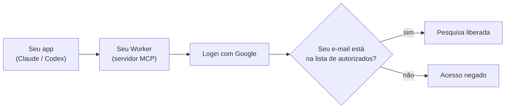

# JurisprudênciaIA MCP

Conector MCP **auto-hospedado** para pesquisar jurisprudência brasileira direto no Claude, no Codex e em outros clientes MCP — sem instalar nada na máquina de quem vai usar.

Você sobe o servidor uma única vez no seu Cloudflare Worker. Depois, qualquer pessoa autorizada conecta com a própria conta Google e começa a pesquisar. Sem Client ID, sem Client Secret, sem Bearer token para distribuir: o cliente MCP descobre o OAuth sozinho e abre o login do Google.

---

## Para o advogado: o caminho mais rápido

Você não precisa entender de programação para usar. Existe um **guia visual passo a passo**, do zero até a conexão funcionando, com telas ilustradas:

### [Abrir o guia completo →](https://brunoflma.github.io/jurisprudenciaia-mcp/deploy-guide.html)

O link abre o guia **já formatado** no navegador, com as telas e o botão "copiar" nos comandos. Nada para instalar nem extrair.

Prefere ler offline? [Baixe o pacote com as imagens (.zip)](docs/assets/oauth-guide/guia-conexao-advogado.zip), descompacte e dê dois cliques em `deploy-guide.html`.

---

## Como fica na prática

Veja o que aparece na tela ao conectar (imagens ilustrativas com dados fictícios):

**1. Adicionar o conector** — você informa um nome e a URL do seu servidor.

**2. Autorizar com o Google** — uma tela simples explica o acesso e pede para continuar com a sua conta.

**3. Conexão concluída** — o conector aparece como ativo, com as ferramentas disponíveis.

---

## Como funciona (versão simples)

Em três frases: você publica o servidor uma vez; cadastra os e-mails autorizados na variável `MCP_ALLOWED_EMAILS`; quem estiver na lista entra com o Google e usa, quem não estiver fica de fora.

---

## Estado dos clientes

| Cliente | Status | Autenticação |
|---------|--------|--------------|
| Codex | Suportado para uso normal | OAuth 2.1, PKCE S256 e Google |
| Claude | Suportado para uso normal | OAuth 2.1, PKCE S256 e Google |

---

## Visão técnica (para quem configura o servidor)

Se você é a pessoa que vai subir o Worker, estes são os pontos essenciais:

- **Autenticação**: OAuth 2.1 com PKCE S256 e identidade Google. O cliente se registra dinamicamente; não há segredo adicional embutido. O Client Secret do Google fica no Worker, em `MCP_GOOGLE_CLIENT_SECRET` (e nunca no cliente final).
- **Autorização**: allowlist de e-mails em `MCP_ALLOWED_EMAILS`.
- **Hospedagem**: Cloudflare Workers.

Documentação de referência:

- [Guia de implantação (detalhado)](docs/deployment.md)
- [Conectar no Codex](docs/codex.md)
- [Conectar no Claude](docs/claude-3p.md)
- [Compatibilidade, segurança e verificação](docs/compatibility-and-security.md)
