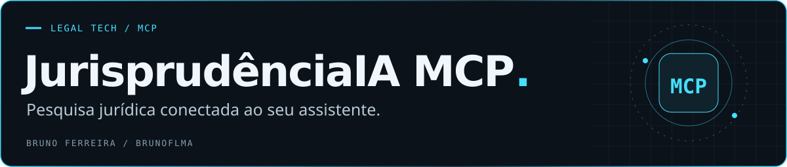
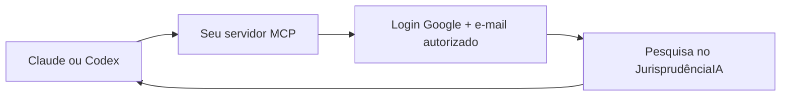
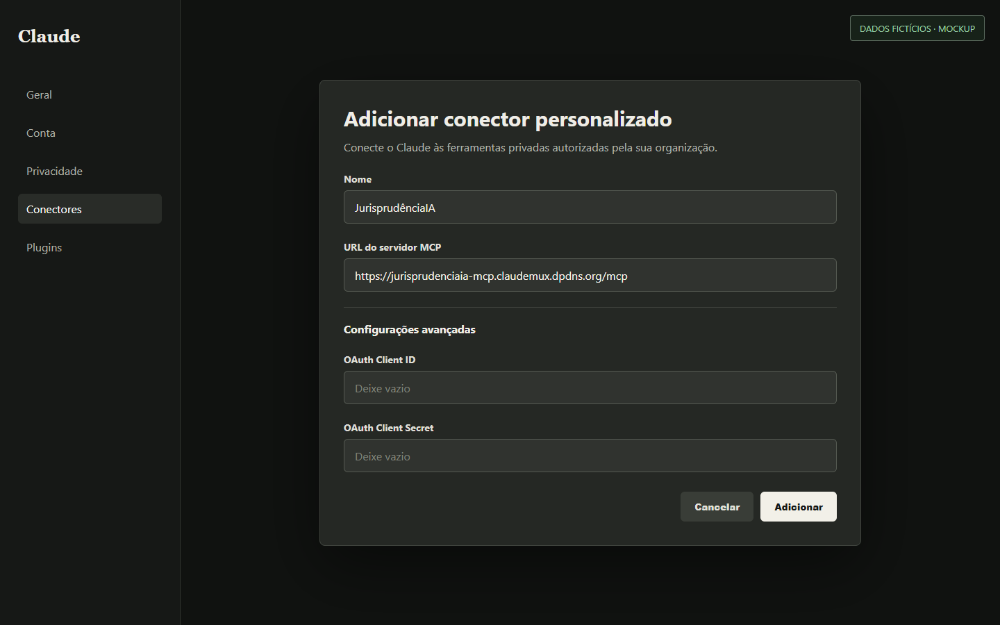
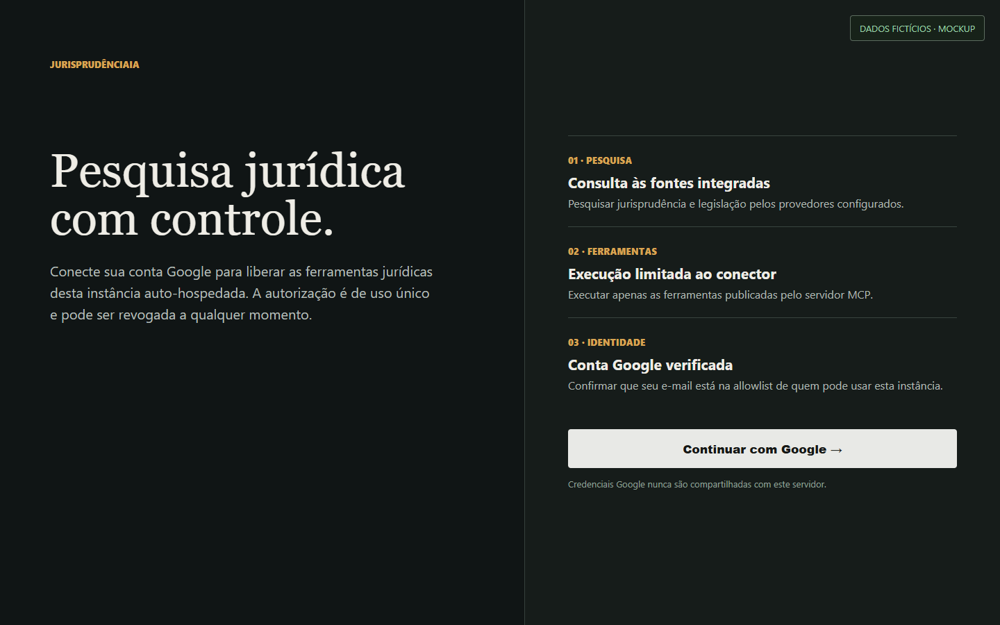
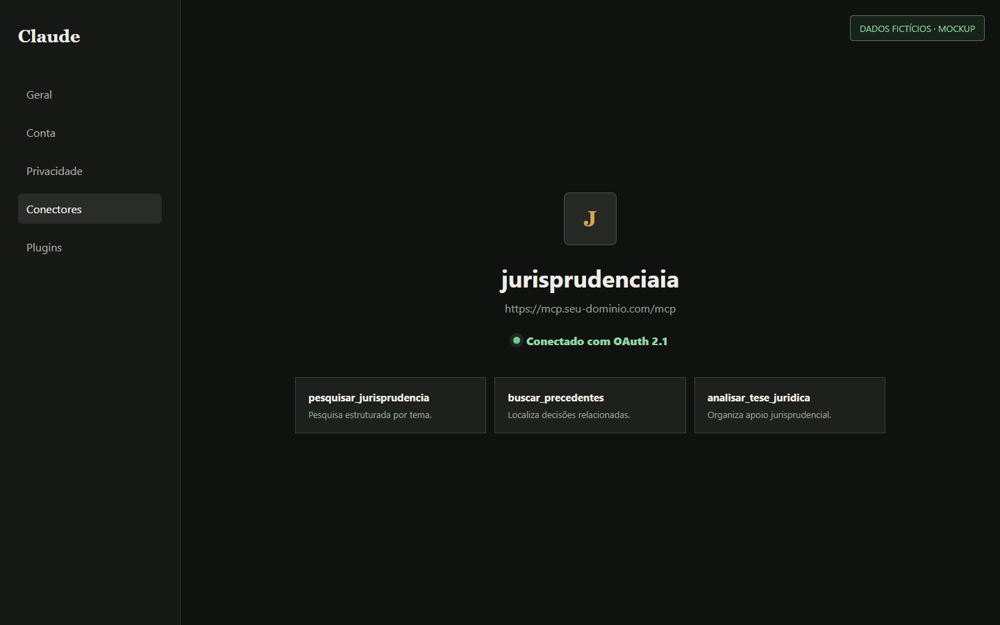

# JurisprudênciaIA MCP

**Pesquise jurisprudência brasileira dentro da conversa em que você trabalha.**

Este conector aproxima o serviço JurisprudênciaIA de assistentes compatíveis com MCP. Você configura um servidor próprio no Cloudflare Workers; as pessoas autorizadas entram com a conta Google e passam a usar as ferramentas de pesquisa no assistente.

**[Abrir o guia visual de conexão ↗](https://brunoflma.github.io/jurisprudenciaia-mcp/deploy-guide.html)** · [Configurar o servidor](docs/deployment.md) · [Conectar no Codex](docs/codex.md) · [Conectar no Claude](docs/claude-3p.md)

## Da pesquisa à conversa

| O que você precisa | Como o conector ajuda |
| :--- | :--- |
| Consultar jurisprudência durante a análise de um assunto | Disponibiliza a pesquisa do JurisprudênciaIA como ferramentas do assistente. |
| Compartilhar o acesso com pessoas autorizadas | Usa login Google e uma lista de e-mails permitidos no servidor. |
| Manter a integração sob seu controle | O servidor é hospedado no seu próprio Cloudflare Worker. |
| Conectar sem distribuir um token manual a cada usuário | O cliente compatível descobre o fluxo OAuth e apresenta o login. |

O conector cuida da integração e do acesso. A base e o serviço de pesquisa são do **JurisprudênciaIA**. Os resultados precisam ser lidos e conferidos nas fontes antes de uso profissional.

## Escolha seu ponto de partida

### Quero usar no meu assistente

1. Peça a URL do servidor à pessoa responsável pela configuração.
2. Adicione essa URL como conector no seu cliente compatível.
3. Entre com a conta Google que foi autorizada.
4. Confirme que o assistente passou a exibir as ferramentas do conector.

O [guia visual](https://brunoflma.github.io/jurisprudenciaia-mcp/deploy-guide.html) explica o caminho completo. Para ler offline, [baixe o guia com as imagens](docs/assets/oauth-guide/guia-conexao-advogado.zip), extraia o pacote e abra `deploy-guide.html`.

### Quero configurar meu servidor

Siga o [guia de implantação](docs/deployment.md). Ele reúne os requisitos, as variáveis e a configuração de autenticação.

Os pontos centrais são:

- **Servidor:** Cloudflare Workers.
- **Identidade:** conta Google, com OAuth 2.1 e PKCE S256.
- **Acesso:** e-mails autorizados em `MCP_ALLOWED_EMAILS`.
- **Segredo do Google:** `MCP_GOOGLE_CLIENT_SECRET`, armazenado no Worker.
- **Clientes:** registro dinâmico no fluxo de autenticação descrito nos guias.

## O caminho de uma consulta

## Clientes documentados

| Cliente | Guia | Autenticação |
| :--- | :--- | :--- |
| Claude | [Conexão no Claude](docs/claude-3p.md) | OAuth 2.1, PKCE S256 e Google |
| Codex | [Conexão no Codex](docs/codex.md) | OAuth 2.1, PKCE S256 e Google |

Outros clientes MCP podem ter requisitos próprios. Verifique a compatibilidade do cliente com o fluxo de autenticação antes de utilizá-lo.

<strong>Veja as etapas de conexão</strong>

As telas abaixo são ilustrativas e usam dados fictícios.

**1. Adicionar o conector**

**2. Autorizar a conta Google**

**3. Confirmar a conexão**

## Documentação e colaboração

[Implantação](docs/deployment.md) · [Guia visual](https://brunoflma.github.io/jurisprudenciaia-mcp/deploy-guide.html) · [Problemas e sugestões](https://github.com/brunoflma/jurisprudenciaia-mcp/issues)

Ao relatar um problema, informe o cliente utilizado e a etapa em que a conexão falhou. Remova tokens, segredos e dados de processos dos exemplos enviados.

Desenvolvido por [Bruno Ferreira](https://github.com/brunoflma). Conheça também o [Jusmanizer](https://github.com/brunoflma/jusmanizer), voltado à revisão do estilo da escrita jurídica.
