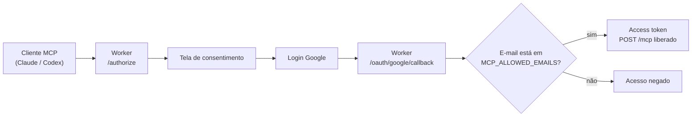

# JurisprudênciaIA MCP

Conector MCP auto-hospedado para pesquisar jurisprudência brasileira no Claude, no Codex e em outros clientes MCP. A autenticação usa **OAuth 2.1 com PKCE S256 e login pela conta Google**, com uma allowlist de e-mails controlada por você.

Você publica o conector no seu próprio Cloudflare Worker. Ninguém precisa distribuir Client ID, Client Secret ou Bearer token para os usuários finais: o cliente MCP descobre o OAuth sozinho, registra-se dinamicamente e abre o login do Google.



## Sumário

- [Antes de começar](#antes-de-começar)
- [Instalação passo a passo](#instalação-passo-a-passo)
- [Conectar no Claude](#conectar-no-claude)
- [Conectar no Codex](#conectar-no-codex)
- [Estado dos clientes](#estado-dos-clientes)
- [Ferramentas](#ferramentas)
- [Variáveis e segredos](#variáveis-e-segredos)
- [Verificação e diagnóstico](#verificação-e-diagnóstico)
- [Manutenção e revogação](#manutenção-e-revogação)
- [Segurança](#segurança)
- [Uso responsável](#uso-responsável)

## Antes de começar

Você vai precisar de:

- Node.js 22 ou superior e npm;
- uma conta Cloudflare (o plano gratuito atende, mas Durable Objects exigem o plano Workers Paid em algumas contas);
- um projeto no Google Cloud para criar o OAuth Client;
- o e-mail Google de cada pessoa que poderá usar o conector.

Todo o passo a passo abaixo leva cerca de 20 minutos na primeira vez.

## Instalação passo a passo

### Passo 1 — Clonar e instalar

```bash
git clone https://github.com/brunoflma/jurisprudenciaia-mcp.git
cd jurisprudenciaia-mcp
npm install
```

### Passo 2 — Autenticar o Wrangler no Cloudflare

```bash
npx wrangler login
```

Confirme a conta correta com `npx wrangler whoami`.

### Passo 3 — Criar os namespaces KV

O conector usa dois KV: um para cache de pesquisa e outro para clientes, grants e tokens OAuth.

```bash
npx wrangler kv namespace create JURIS_CACHE
npx wrangler kv namespace create OAUTH_KV
```

Cada comando devolve um `id`. Abra [`wrangler.jsonc`](wrangler.jsonc) e substitua os valores `replace-with-your-...-kv-id` pelos IDs retornados.

### Passo 4 — Definir a origem pública do Worker

A origem pública é o endereço HTTPS onde o Worker vai responder. Escolha uma das opções:

- **workers.dev** (mais simples): o endereço será `https://jurisprudenciaia-mcp.<sua-subconta>.workers.dev`. Você descobre a subconta no painel do Cloudflare ou após o primeiro deploy.
- **domínio próprio**: adicione um bloco `routes` em `wrangler.jsonc` com `{ "pattern": "mcp.seu-dominio.com", "custom_domain": true }` e ajuste `workers_dev` para `false`.

Em `wrangler.jsonc`, coloque a origem escolhida em `MCP_PUBLIC_ORIGIN` e em `MCP_GOOGLE_CALLBACK_ORIGIN` (normalmente são iguais).

### Passo 5 — Criar o OAuth Client no Google

No [Google Cloud Console](https://console.cloud.google.com/apis/credentials):

1. Configure a tela de consentimento OAuth do projeto.
2. Crie uma credencial do tipo **ID do cliente OAuth → Aplicativo da Web**.
3. Em **URIs de redirecionamento autorizados**, cadastre exatamente um endereço, formado pela sua origem pública mais `/oauth/google/callback`:

   ```text
   https://mcp.seu-dominio.com/oauth/google/callback
   ```

4. Copie o **Client ID** para `MCP_GOOGLE_CLIENT_ID` em `wrangler.jsonc` (é um valor público).
5. Guarde o **Client Secret** — ele vai virar um segredo do Worker no próximo passo, nunca um valor versionado.

Não cadastre endereços `127.0.0.1` no Google. O callback loopback pertence ao Codex e é tratado pelo Worker.

### Passo 6 — Gravar os segredos do Worker

```bash
npx wrangler secret put MCP_GOOGLE_CLIENT_SECRET
npx wrangler secret put MCP_ALLOWED_EMAILS
```

`MCP_ALLOWED_EMAILS` recebe os e-mails autorizados separados por vírgula, por exemplo `pessoa1@example.com,pessoa2@example.com`. Sem essa allowlist, toda autorização é recusada — é ela que impede que qualquer conta Google acesse o seu conector.

### Passo 7 — Verificar e publicar

```bash
npm run verify
npm run deploy:worker
```

`npm run verify` gera os tipos do Cloudflare, roda typecheck, testes, auditoria de dependências e build. Ao final do deploy, o Wrangler mostra a URL do Worker.

### Passo 8 — Confirmar que está no ar

```bash
curl https://mcp.seu-dominio.com/healthz
```

Resposta esperada:

```json
{"ok":true,"service":"jurisprudenciaia-mcp"}
```

Se você usou workers.dev e o endereço final ficou diferente do que colocou em `MCP_PUBLIC_ORIGIN`, corrija as duas variáveis, atualize o redirect no Google e publique de novo. A origem precisa bater exatamente, senão o Google recusa o callback.

O endereço que você entrega aos usuários é a origem pública mais `/mcp`.

## Conectar no Claude

1. Abra **Configurações → Conectores**.
2. Adicione um conector personalizado chamado `JurisprudênciaIA`.
3. Informe somente a URL do conector:

   ```text
   https://mcp.seu-dominio.com/mcp
   ```

4. Deixe os campos avançados de Client ID e Client Secret vazios.
5. Clique em **Adicionar** ou **Vincular**.
6. Na página de autorização, clique em **Continuar com Google**.
7. Escolha uma conta Google que esteja na allowlist.

O roteiro com imagens está em [`docs/deploy-guide.html`](docs/deploy-guide.html). As imagens são mockups com dados fictícios.

## Conectar no Codex

Cadastre a mesma URL como servidor **Streamable HTTP** e clique em **Autenticar**, ou use a CLI:

```bash
codex mcp login jurisprudenciaia
```

Configuração equivalente em `config.toml`:

```toml
[mcp_servers.jurisprudenciaia]
url = "https://mcp.seu-dominio.com/mcp"
auth = "oauth"
enabled = true
tool_timeout_sec = 120
```

O passo a passo detalhado está em [`docs/codex.md`](docs/codex.md). Outros clientes locais com callback loopback estão em [`docs/claude-3p.md`](docs/claude-3p.md).

## Estado dos clientes

| Cliente | Estado | Autenticação |
| --- | --- | --- |
| Claude.ai | Suportado para uso normal | OAuth 2.1, PKCE S256 e Google |
| Codex | Suportado para uso normal | OAuth 2.1, PKCE S256 e Google |
| ChatGPT | Requer política própria de callback | OAuth 2.1 com callback HTTPS oficial |

O Worker aceita os callbacks HTTPS oficiais do Claude e o callback loopback efêmero do Codex. Outros clientes só devem ser anunciados como compatíveis depois que seus redirects forem validados no código e nos testes.

## Ferramentas

O conector publica quatorze ferramentas MCP:

- `consultar_jurisprudenciaia`
- `pesquisar_jurisprudencia`
- `buscar_precedentes`
- `analisar_tese_juridica`
- `comparar_teses_juridicas`
- `buscar_por_cnj`
- `pesquisar_legislacao`
- `buscar_informativos`
- `analisar_jurimetria`
- `linha_do_tempo_precedentes`
- `buscar_citacoes_dispositivo`
- `historico_alteracoes_norma`
- `listar_overruling_tema`
- `buscar_precedentes_qualificados`

As ferramentas especializadas transformam seus campos em consultas estruturadas e usam o mesmo mecanismo do JurisprudênciaIA. Recortes e tribunais orientam a pesquisa textual; não representam filtros oficiais nem uma base estatística independente.

## Variáveis e segredos

Variáveis públicas em `wrangler.jsonc`:

| Nome | Função |
| --- | --- |
| `MCP_PUBLIC_ORIGIN` | Origem canônica HTTPS do servidor OAuth |
| `MCP_GOOGLE_CALLBACK_ORIGIN` | Origem usada para montar o callback do Google |
| `MCP_GOOGLE_CLIENT_ID` | Identificador público do OAuth Client Google |
| `JURISPRUDENCIAIA_URL` | Serviço de pesquisa consultado pelo runner |
| `REQUEST_TIMEOUT_MS` | Limite de tempo da consulta |
| `RATE_LIMIT_WINDOW_MS` | Janela do rate limit |
| `RATE_LIMIT_MAX_REQUESTS` | Requisições permitidas por janela |

Segredos, gravados apenas com `wrangler secret put`:

| Nome | Função |
| --- | --- |
| `MCP_GOOGLE_CLIENT_SECRET` | Client Secret do OAuth Client Google |
| `MCP_ALLOWED_EMAILS` | Allowlist de e-mails autorizados |
| `MCP_BEARER_TOKEN` | Opcional, apenas para smoke tests administrativos |

`MCP_ALLOWED_ORIGINS` e `MCP_ICON_URL` são opcionais. Não use origem curinga. O arquivo [`.env.example`](.env.example) cobre a execução local com `.dev.vars`.

## Verificação e diagnóstico

```bash
npm run verify
npm run check:claude-oauth -- https://mcp.seu-dominio.com/mcp
```

O diagnóstico confirma descoberta de metadados, registro dinâmico, PKCE S256 e redirecionamento para autorização. Para o Codex, valide com `codex mcp login jurisprudenciaia`.

O comando `npm run check:codex-http` exige o Bearer administrativo e existe apenas para smoke tests sem navegador. Usuários normais devem usar OAuth.

## Manutenção e revogação

Para remover uma pessoa, retire o e-mail de `MCP_ALLOWED_EMAILS` e revogue os tokens persistidos.

Em caso de suspeita de vazamento:

1. Gire `MCP_GOOGLE_CLIENT_SECRET` no Google e no Worker.
2. Gire `MCP_BEARER_TOKEN`, se configurado.
3. Revogue clientes, grants ou tokens OAuth afetados no armazenamento do Worker.
4. Inspecione logs somente por códigos e request IDs.

O guia completo de operação está em [`docs/deployment.md`](docs/deployment.md).

## Segurança

- A senha Google nunca é entregue ao Worker nem ao cliente MCP.
- O Client Secret do Google existe somente no Google Cloud e nos segredos do Worker.
- A allowlist é validada no servidor depois que o Google confirma o e-mail.
- Estados OAuth são vinculados ao navegador, de uso único e armazenados em Durable Object.
- O endpoint MCP exige access token OAuth ou Bearer administrativo válido.
- Logs não devem conter tokens, códigos OAuth, e-mail completo, consultas jurídicas ou conteúdo de processos.
- Prints de documentação devem usar dados fictícios; nunca capture o seletor real de contas Google.

## Uso responsável

O conector ajuda a encontrar e organizar pesquisa jurídica, mas a revisão final continua sendo profissional. Antes de citar um precedente em peça, parecer ou minuta, confira o inteiro teor e a fonte oficial indicada no resultado.
